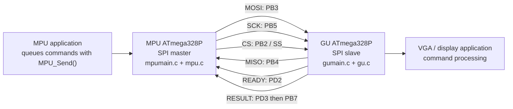

# AVR MPU/GU Link

This project is a two-ATmega328P embedded communication prototype. The MPU sends
framed graphics and display commands over a hardware-SPI link to a GU. The GU
accepts packets in its SPI interrupt handlers, validates them without doing
protocol work in the VGA timing interrupt, queues accepted commands, and exposes
those commands to the application loop.

The code in `mpu.c`, `gu.c`, and `protocol.h` is the source of truth for the
current protocol and timing contract. The documentation below describes the
behavior that the implementation actually enforces.

The link is designed for short, non-blocking transactions:

- The MPU owns transmission and acts as the SPI master.
- The GU is the SPI slave and drives a `READY` output.
- The GU also drives a dedicated `RESULT` output that reports accept/reject for
  the most recently received DATA packet.
- Packets are protected with CRC-16/XMODEM.
- Sequence numbers detect dropped, duplicated, or out-of-order packets.
- Duplicate retransmissions of the most recently accepted packet are accepted
  without executing the command again.
- A packet is only considered accepted once the GU has stored it in its command
  queue; acceptance does not imply that the command has already executed.

## Hardware Architecture

The MPU and GU are both ATmega328P parts running from a shared external 20 MHz
clock source fed into `XTAL1` (`PB6`). Neither chip uses a crystal, so `XTAL2`
(`PB7`) is available for GPIO use when not reserved by the design. The link uses
ATmega328P hardware SPI in master/slave mode with manual chip select from the MPU.



### Wiring

| Signal | MPU pin | GU pin | Direction / purpose |
| --- | --- | --- | --- |
| MOSI | PB3 / MOSI (D11, DIP pin 17), output | PB3 / MOSI (D11, DIP pin 17), input | MPU to GU data |
| MISO | PB4 / MISO (D12, DIP pin 18), input | PB4 / MISO (D12, DIP pin 18), output | GU status/data feedback |
| SCK | PB5 / SCK (D13, DIP pin 19), output | PB5 / SCK (D13, DIP pin 19), input | SPI clock from MPU |
| CS | PB2 / SS (D10, DIP pin 16), output | PB2 / SS (D10, DIP pin 16), input | MPU selects a transaction |
| READY | PD2 (D2, DIP pin 4), input | PD2 (D2, DIP pin 4), output | GU indicates it is ready or that a result is valid |
| RESULT | PB7 (DIP pin 13), input | PD3 (D3, DIP pin 5) by default, output | Accept/reject bit for the last DATA packet |
| XTAL1 | PB6 (DIP pin 9), external clock in | PB6 (DIP pin 9), external clock in | Shared 20 MHz external clock source |
| GND | GND | GND | Common reference |

Notes:

- The MPU samples `RESULT` only after it sees `READY` go high. That ordering is
  important and is enforced by the code.
- The GU-side `RESULT` pin is a board-level choice: the implementation uses `PD3`
as a default output, but any GPIO not consumed by the VGA timing can be used.
- `PB6` must remain tied to the external clock and cannot be used as a GPIO.
- The MPU expects the `READY` and `RESULT` lines to have external pull-downs or
  otherwise defined idle-low states.

## Protocol Overview

### DATA transaction format

An MPU DATA transaction is selected with chip select and contains:

```text
SOF | SEQ | LEN | TYPE | PAYLOAD[0..LEN-1] | CRC16 low | CRC16 high
```

`SOF` is `0xA5`, `LEN` is the payload length in bytes, and the CRC covers
`SEQ`, `LEN`, `TYPE`, and all payload bytes. The first packet starts at sequence
zero; the GU increments its expected sequence after accepting a packet. The maximum
payload size is 24 bytes.

### Accept/reject handshake

The current protocol does not use a separate SPI status-poll sub-transaction.
Instead, after sending a DATA packet, the MPU waits for the GU to assert `READY`.
When `READY` goes high, the MPU samples the GU `RESULT` pin:

- `RESULT = 0` means ACCEPT
- `RESULT = 1` means REJECT

The meaning of REJECT is implementation-defined by the local GU-side diagnostics
for the most recent packet. The wire only carries a single accept/reject bit. The
reason codes (`CRC`, `SEQ`, `FORMAT`, `BUSY`, and so on) remain inside the GU for
local diagnostics and are not sent back over the link.

The MPU keeps the head packet in its transmit queue until it sees a valid ACCEPT
for that sequence number. It retries the same packet after recoverable errors and
keeps the transmission state machine alive even through resets or temporary
delays.

## Graphics Commands

The protocol defines high-level graphics commands sent from MPU to GU. Multi-byte
integer fields such as coordinates and radius are serialized little-endian
(`uint16_t`).

| Command | Type ID | Payload Structure | Parameters & Format |
| --- | --- | --- | --- |
| `setpixel` | `0x01` (`CMD_SET_PIXEL`) | `[X0, X1, Y0, Y1, Color]` | `x: uint16`, `y: uint16`, `color: uint8` (4 bits used for 16 colors) |
| `setline` | `0x02` (`CMD_SET_LINE`) | `[X1_0, X1_1, Y1_0, Y1_1, X2_0, X2_1, Y2_0, Y2_1, Color]` | `x1, y1, x2, y2: uint16`, `color: uint8` (4 bits used) |
| `setrect` | `0x03` (`CMD_SET_RECT`) | `[X1_0, X1_1, Y1_0, Y1_1, X2_0, X2_1, Y2_0, Y2_1, Color]` | `x1, y1, x2, y2: uint16`, `color: uint8` (low nibble border, high nibble fill) |
| `setcircle` | `0x04` (`CMD_SET_CIRCLE`) | `[X0, X1, Y0, Y1, R0, R1, Color]` | `x: uint16`, `y: uint16`, `radius: uint16`, `color: uint8` (low nibble border, high nibble fill) |
| `setstring` | `0x05` (`CMD_SET_STRING`) | `[X0, X1, Y0, Y1, Color, Text..., 0x00]` | `x: uint16`, `y: uint16`, `color: uint8`, `text: string0` (null-terminated) |

### MPU helper API

The MPU provides helper functions that format a command payload and enqueue it:

- `MPU_SendSetPixel(x, y, color)`
- `MPU_SendSetLine(x1, y1, x2, y2, color)`
- `MPU_SendSetRect(x1, y1, x2, y2, color)` / `MPU_SendSetRectEx(x1, y1, x2, y2, border, fill)`
- `MPU_SendSetCircle(x, y, radius, color)` / `MPU_SendSetCircleEx(x, y, radius, border, fill)`
- `MPU_SendSetString(x, y, color, text)`

### GU decoding API

The GU exposes parser helpers in `protocol.h` to decode structured arguments from
received payloads:

- `GU_ParseSetPixel(...)`
- `GU_ParseSetLine(...)`
- `GU_ParseSetRect(...)`
- `GU_ParseSetCircle(...)`
- `GU_ParseSetString(...)`

## Runtime Flow

1. The application calls `MPU_Send()` to append a packet to the MPU transmit
   queue.
2. `MPU_Service()` checks `READY`, sends the oldest packet, and enters the
   result-wait period without blocking the main loop.
3. The GU receives bytes in `GU_CS_ISR()` and `GU_SPI_STC_ISR()`. Those
   interrupt handlers capture the transaction state and bytes with minimal work.
4. `GU_Service()` validates the completed DATA packet, checks CRC and sequence,
and either enqueues it or prepares a reject outcome by driving `RESULT` and
raising `READY`.
5. The MPU waits for `READY` and then reads `RESULT`. On ACCEPT it removes the
   packet from the queue; on REJECT it retransmits the same packet without
   changing its sequence number.
6. `GU_GetCommand()` transfers queued commands to the GU application loop, where
   display behavior can be implemented.

The VGA timer interrupt is intentionally kept separate from protocol parsing,
CRC validation, queue operations, and command execution. This protects the
frame-timing path from link-processing latency.

## Files

| File | Purpose |
| --- | --- |
| `Design.txt` | Wiring notes for the MPU/GU link and the current pin map. |
| `protocol.h` | Shared packet structures, protocol constants, queue sizes, retry/backoff limits, and CRC helpers. |
| `mpu.h` | Public MPU master-link API and diagnostics. |
| `mpu.c` | MPU hardware SPI master, GPIO setup, transmit queue, packet framing, result-wait state machine, and initialization. |
| `mpumain.c` | MPU entry point, 1 ms timer tick, and example command submission. |
| `gu.h` | Public GU slave-link API and command retrieval API. |
| `gu.c` | GU SPI slave logic, packet validation, READY/RESULT handling, command queue, and initialization. |
| `gumain.c` | GU application entry point, VGA timer placeholder, link ISR hooks, and example command dispatcher. |
| `.vscode/tasks.json` | VS Code tasks for building the MPU image, GU image, or both. |
| `.gitignore` | Excludes AVR compiler artifacts and local build output. |
| `mpubin.elf`, `gubin.elf` | Generated ELF outputs when present; they are ignored by Git and can be rebuilt. |
| `README.md` | Project overview and protocol reference. |

## Building

### VS Code

Run the default Build all task. It builds both targets in sequence:

- Build mpu compiles `mpumain.c` and `mpu.c` for `atmega328p`.
- Build gu compiles `gumain.c` and `gu.c` for `atmega328p`.

Both tasks define `F_CPU=20000000UL`, optimize with `-Os`, and write the ELF
output in the project root.

### Command line

With `avr-gcc` available on `PATH`, the equivalent commands are:

```sh
avr-gcc mpumain.c mpu.c -o mpubin.elf -mmcu=atmega328p -DF_CPU=20000000UL -Os
avr-gcc gumain.c gu.c -o gubin.elf -mmcu=atmega328p -DF_CPU=20000000UL -Os
```

The checked-in VS Code task uses the AVR toolchain at
`C:/AVR/avr8-gnu-toolchain-win32_x86_64/bin/avr-gcc.exe`.

## Current Scope

This repository provides the link layer, the command definitions, the queueing
logic, and example application hooks. The actual VGA timing implementation and
rendering code for the graphic command types (`0x01` through `0x05`) are left as
placeholders in `gumain.c`.

A production build should still verify signal integrity on the real board, choose
an SPI clock rate that remains safe for the final VGA timing budget, and add
hardware tests for packet loss, duplicates, queue-full behavior, and reset or
re-synchronization paths.
