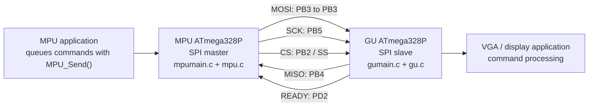

# AVR MPU/GU Link

This project is a two-AVR embedded communication prototype. An ATmega328P (the
MPU) sends framed graphics or display commands over a hardware-SPI link to
another ATmega328P (the GU). The GU receives commands without doing protocol work
in its VGA timing interrupt, queues accepted commands, and makes them available
to the application loop.

The link is designed for short, non-blocking transactions:

- The MPU owns transmission and acts as the SPI master.
- The GU is the SPI slave and controls a `READY` line.
- Packets are protected with CRC-16/XMODEM.
- Sequence numbers detect lost or out-of-order packets.
- Retransmissions of the most recently accepted packet are ACKed without
  executing the command twice.
- The GU acknowledges a packet when it has stored it in its command queue; an
  ACK does not mean that the display command has already executed.

## Hardware Architecture

The MPU is an ATmega328P running at 20 MHz and uses its hardware SPI
peripheral in master mode. The GU is also an ATmega328P running at 20 MHz and
uses its hardware SPI peripheral in slave mode. The GU handles chip-select and
SPI transfer-complete events with interrupts. Both AVRs share a single
external 20 MHz clock signal fed into `XTAL1`; neither chip uses a crystal, so
`XTAL2` is free for GPIO use on both.



### Wiring

| Signal | MPU pin | GU pin | Direction / purpose |
| --- | --- | --- | --- |
| MOSI | PB3 / MOSI (D11, DIP pin 17), output | PB3 / MOSI (D11, DIP pin 17), input | MPU to GU data |
| MISO | PB4 / MISO (D12, DIP pin 18), input | PB4 / MISO (D12, DIP pin 18), output | GU to MPU status/data |
| SCK | PB5 / SCK (D13, DIP pin 19), output | PB5 / SCK (D13, DIP pin 19), input | MPU-generated SPI clock |
| CS | PB2 / SS (D10, DIP pin 16), output | PB2 / SS (D10, DIP pin 16), input | MPU selects a transaction |
| READY | PD2 (D2, DIP pin 4), input | PD2 (D2, DIP pin 4), output | GU indicates status/data availability |
| XTAL1 | PB6 (DIP pin 9), external clock in | PB6 (DIP pin 9), external clock in | Shared 20 MHz external clock source |
| GND | GND | GND | Common reference |

The MPU `READY` input expects an external pull-down. The GU drives `READY`
high when a status response is available or when it can accept another data
transaction. Both AVRs are clocked from a single shared external 20 MHz
oscillator wired to `XTAL1` (`PB6`) on each chip; `XTAL2` (`PB7`) is unused by
the clock source and is free for GPIO on both chips. Do not use `PB6` as a
GPIO on either chip.

## Protocol Overview

### Data transaction

An MPU data transaction is selected with chip select and contains:

```text
SOF | SEQ | LEN | TYPE | PAYLOAD[0..LEN-1] | CRC16 low | CRC16 high
```

`SOF` is `0xA5`, the maximum payload is 24 bytes, and the CRC covers `SEQ`,
`LEN`, `TYPE`, and all payload bytes. The first packet starts at sequence zero;
the GU increments its expected sequence after accepting a packet.

### Status transaction

After sending data, the MPU polls with `0x5A`. The GU returns:

```text
STATUS | SEQ
```

The status values include `ACK`, CRC/format/sequence errors, and `BUSY`. The
MPU retains the head packet in its transmit queue until it receives an ACK for
the matching sequence number. It retries up to five times after the initial
transmission, with a 10 ms status timeout.

## Graphics Commands

The protocol defines high-level graphics commands sent from MPU to GU. Multi-byte integer fields (coordinates and radius) are serialized in little-endian order (`uint16_t`).

| Command | Type ID | Payload Structure | Parameters & Format |
| --- | --- | --- | --- |
| `setpixel` | `0x01` (`CMD_SET_PIXEL`) | `[X0, X1, Y0, Y1, Color]` | `x: uint16`, `y: uint16`, `color: uint8` (4 bits used for 16 colors) |
| `setline` | `0x02` (`CMD_SET_LINE`) | `[X1_0, X1_1, Y1_0, Y1_1, X2_0, X2_1, Y2_0, Y2_1, Color]` | `x1, y1, x2, y2: uint16`, `color: uint8` (4 bits used) |
| `setrect` | `0x03` (`CMD_SET_RECT`) | `[X1_0, X1_1, Y1_0, Y1_1, X2_0, X2_1, Y2_0, Y2_1, Color]` | `x1, y1, x2, y2: uint16`, `color: uint8` (4 bits border in low nibble, 4 bits fill in high nibble) |
| `setcircle` | `0x04` (`CMD_SET_CIRCLE`) | `[X0, X1, Y0, Y1, R0, R1, Color]` | `x: uint16`, `y: uint16`, `radius: uint16`, `color: uint8` (4 bits border in low nibble, 4 bits fill in high nibble) |
| `setstring` | `0x05` (`CMD_SET_STRING`) | `[X0, X1, Y0, Y1, Color, Text..., 0x00]` | `x: uint16`, `y: uint16`, `color: uint8` (4 bits used), `text: string0` (null-terminated string) |

### MPU Helper API

The MPU provides helper functions to format payloads and push commands into the transmit queue:

- `MPU_SendSetPixel(x, y, color)`
- `MPU_SendSetLine(x1, y1, x2, y2, color)`
- `MPU_SendSetRect(x1, y1, x2, y2, color)` / `MPU_SendSetRectEx(x1, y1, x2, y2, border, fill)`
- `MPU_SendSetCircle(x, y, radius, color)` / `MPU_SendSetCircleEx(x, y, radius, border, fill)`
- `MPU_SendSetString(x, y, color, text)`

### GU Decoding API

The GU provides parser functions in `protocol.h` to cleanly extract structured arguments:

- `GU_ParseSetPixel(...)`
- `GU_ParseSetLine(...)`
- `GU_ParseSetRect(...)`
- `GU_ParseSetCircle(...)`
- `GU_ParseSetString(...)`

## Runtime Flow

1. The application calls `MPU_Send()` to append a command to the MPU transmit
   queue.
2. `MPU_Service()` checks `READY`, sends the oldest packet, and enters the
   status-wait state without blocking the main loop.
3. The GU receives bytes in `GU_CS_ISR()` and `GU_SPI_STC_ISR()`. Those
   interrupt handlers only capture transaction state and bytes.
4. `GU_Service()` validates the packet, checks CRC and sequence, and queues an
   accepted command or prepares a NACK response.
5. The MPU polls the GU status. On ACK, it removes the packet; on a recoverable
   failure, it retransmits the same sequence number.
6. `GU_GetCommand()` transfers queued commands to the GU application loop,
   where command-specific display behavior can be implemented.

The VGA timer interrupt is intentionally kept separate from protocol parsing,
CRC calculation, queue operations, and command execution. This protects
timing-critical display work from link processing.

## Files

| File | Purpose |
| --- | --- |
| `Design.txt` | Original wiring notes for the MPU/GU signals. |
| `protocol.h` | Shared packet structures, protocol constants, queue sizes, timeout/retry limits, and CRC-16/XMODEM helpers. |
| `mpu.h` | Public MPU master-link API and diagnostic helpers. |
| `mpu.c` | MPU hardware SPI master, GPIO and timer setup, transmit queue, packet framing, status polling, retry state machine, and initialization. |
| `mpumain.c` | MPU entry point, 1 ms timer ISR, and example command submission. |
| `gu.h` | Public GU slave-link API, command retrieval API, and ISR entry points. |
| `gu.c` | GU ATmega328P SPI slave, chip-select and transfer-complete handling, packet validation, status generation, sequence tracking, command queue, and initialization. |
| `gumain.c` | GU entry point, VGA timer ISR placeholder, link ISRs, and example command dispatcher. |
| `.vscode/tasks.json` | VS Code tasks for building the MPU image, GU image, or both. |
| `.gitignore` | Excludes AVR compiler artifacts and local build/IDE output. |
| `mpubin.elf`, `gubin.elf` | Generated ELF outputs when present; they are ignored by Git and can be rebuilt. |
| `README.md` | This project overview and hardware/protocol reference. |

## Building

### VS Code

Run the default **Build all** task. It builds both targets in sequence:

- **Build mpu** compiles `mpumain.c` and `mpu.c` for `atmega328p`.
- **Build gu** compiles `gumain.c` and `gu.c` for `atmega328p`.

Both tasks define `F_CPU=20000000UL`, optimize with `-Os`, and write
`mpubin.elf` or `gubin.elf` in the project directory.

### Command line

With `avr-gcc` available on `PATH`, the equivalent commands are:

```sh
avr-gcc mpumain.c mpu.c -o mpubin.elf -mmcu=atmega328p -DF_CPU=20000000UL -Os
avr-gcc gumain.c gu.c -o gubin.elf -mmcu=atmega328p -DF_CPU=20000000UL -Os
```

The checked-in VS Code task currently uses the AVR toolchain at
`C:/AVR/avr8-gnu-toolchain-win32_x86_64/bin/avr-gcc.exe`.

## Current Scope

This repository provides the link layer, graphic command definitions, helper functions, and example application hooks. The
actual VGA timing implementation and display rendering for graphic command types (`0x01`–`0x05`) are placeholders in `gumain.c`. A production deployment should
also verify electrical signal integrity, choose a safe SPI clock rate for the
final VGA ISR duration, and add target hardware tests for packet loss,
duplicates, queue-full behavior, and reset/re-synchronization.